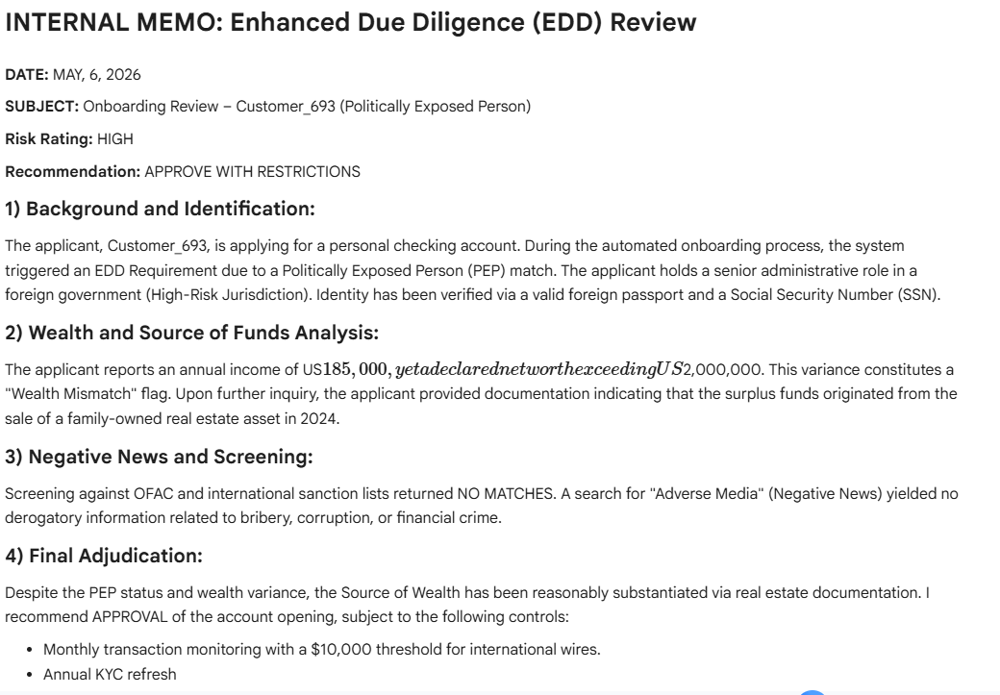

# AML/KYC Onboarding Risk Adjudication System

## Overview

This project simulates an AML/KYC onboarding and risk adjudication workflow inspired by real-world Anti-Money Laundering operations.

The notebook focuses on:
- Customer onboarding risk analysis
- PEP identification
- Sanctions exposure
- Jurisdictional risk
- Enhanced Due Diligence (EDD)
- Risk scoring
- Investigative narratives and adjudication memos

The objective of the project is educational and portfolio-oriented, aiming to demonstrate AML/KYC operational concepts, regulatory reasoning, and analytical workflows using Python.

---

## Features

- Synthetic customer onboarding dataset generation
- Risk scoring engine
- PEP and sanctions screening simulation
- Jurisdiction risk assessment
- EDD escalation logic
- Internal investigative memo generation
- Alert analysis workflow

---

## Technologies Used

- Python
- Pandas
- NumPy
- Faker
- Jupyter Notebook / Google Colab

---

## AML Concepts Covered

- Customer Due Diligence (CDD)
- Enhanced Due Diligence (EDD)
- FATF Risk-Based Approach
- Politically Exposed Persons (PEPs)
- Sanctions screening
- Suspicious activity analysis
- AML risk adjudication

---

## Disclaimer

This project is a fictional educational simulation created for learning and portfolio purposes only.  
It does not represent real customer data, real investigations, or production-grade AML systems.

---

## Future Improvements

- Fuzzy sanctions matching
- False-positive management
- Alert disposition workflows
- Transaction monitoring integration
- Dashboard visualization
- SQL integration

## Sample investigative MEMO

